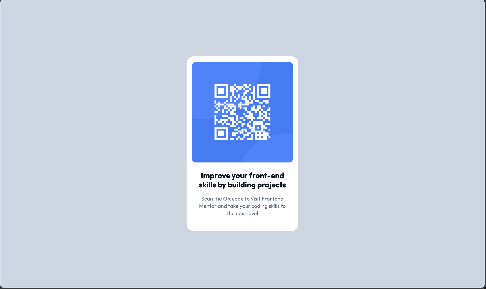
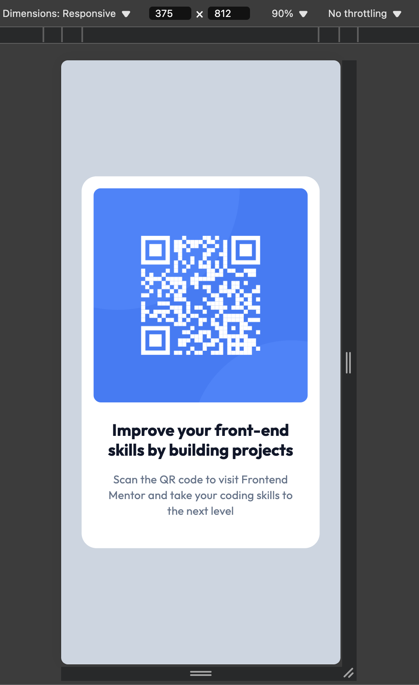

# Frontend Mentor - QR code component solution

This is a solution to the [QR code component challenge on Frontend Mentor](https://www.frontendmentor.io/challenges/qr-code-component-iux_sIO_H). Frontend Mentor challenges help you improve your coding skills by building realistic projects. 

## Overview

### Screenshot

### Links

- Solution URL: [Add solution URL here](https://your-solution-url.com)
- Live Site URL: [Add live site URL here](https://your-live-site-url.com)

## My process

### Built with

- Semantic HTML5 markup
- Flexbox
- Mobile-first workflow
- Tailwindcss
- ChatGPT
- Google Font 

## Author

- Website - [Add your name here](https://www.your-site.com)
- Frontend Mentor - [@yourusername](https://www.frontendmentor.io/profile/yourusername)
- Twitter - [@yourusername](https://www.twitter.com/yourusername)

**Note: Delete this note and add/remove/edit lines above based on what links you'd like to share.**
